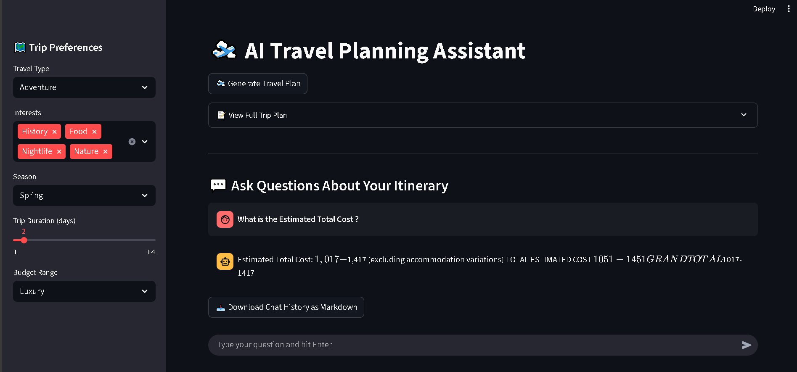

# 📖 AI-Agents-Trip-Planner



## 📌 Overview

**AI-Agents-Trip-Planner** is an AI-powered, agentic trip planning system built using the **CrewAI** framework, **Google Gemini API**, and an interactive **Streamlit** frontend.  
The system personalizes travel plans based on the user's preferences like travel type, interests, season, trip duration, and budget — with AI agents working collaboratively to produce a full itinerary, cost breakdown, local insights, and Q&A support.

## ✨ Features

- 🗺️ **City Selection Expert**: Recommends cities based on preferences, season, and interests.
- 📖 **Local Destination Expert**: Researches local attractions, cuisine, customs, travel tips, and hidden gems.
- 📋 **Professional Travel Planner**: Creates a structured, day-by-day, well-paced trip itinerary.
- 💰 **Travel Budget Manager**: Prepares a detailed, realistic budget breakdown.
- 💬 **Agentic RAG-Powered Q&A**: Lets users ask itinerary-specific questions and get AI-generated answers.
- 🖥️ **Streamlit Interactive UI**: Input preferences, view plans, interact with AI chat, and download itineraries or conversations.

## 🛠️ Tech Stack

**Backend**
- Python 3.11
- CrewAI (AI agent framework)
- Google Gemini API (LLM)
- DuckDuckGo Search & Article Fetch Tools (for external info)
- python-dotenv (for API key management)
- docx (for DOCX itinerary downloads)

**Frontend**
- Streamlit (for interactive web UI)

## 📦 Installation

```bash
# Clone the repository
git clone https://github.com/PriyanshuDey23/AI-Agents-Trip-Planner.git
cd AI-Agents-Trip-Planner

# Install dependencies
pip install -r requirements.txt

# Create a .env file and add your API key
echo "GOOGLE_API_KEY=your_google_api_key_here" > .env
```

## 🚀 How It Works

### 🧭 TripAgents
Initializes four reasoning AI agents:
- **City Selector**
- **Local Destination Expert**
- **Travel Planner**
- **Budget Manager**

Each agent is equipped with a clear role, goal, reasoning ability, and relevant web tools (DuckDuckGo search + article fetch).

### 📋 TripTasks
Defines structured task descriptions for each agent:
- Select suitable cities.
- Research selected cities.
- Plan a detailed multi-day itinerary.
- Prepare an itemized budget based on the itinerary.

### 🤖 TripCrew
Coordinates and runs the CrewAI workflow:
- Initializes agents and their respective tasks.
- Runs them sequentially via CrewAI orchestration.
- Collects structured outputs for each stage of the trip plan.

### 💬 Agentic RAG Q&A
An additional Retrieval-Augmented Generation (RAG) system built using CrewAI that:
- Takes the generated itinerary as context.
- Accepts a user question.
- Returns a reasoned, AI-generated answer specific to that itinerary.

### 🖥️ Streamlit App
- Sidebar to input trip preferences.
- Button to trigger AI trip generation.
- View generated plans in an expandable section.
- Download options for Markdown and DOCX trip files.
- Live AI Q&A chat powered by the agentic RAG system.
- Downloadable Markdown file of chat history.

## 📑 Project Structure

```
.
├── WorkFlow/
│   ├── Agents.py               # Defines agents, tasks, crews for trip planning
│   ├── Agentic_Rag.py          # RAG-powered Q&A agent setup
│   └── Tools.py                # Tools Present
├── app.py                      # Streamlit frontend app
├── .env                        # API keys and environment variables
├── requirements.txt            # Python dependencies
└── README.md                   # Project documentation (this file)
```

## 📊 Example Inputs

```python
inputs = {
    'travel_type': 'Leisure',
    'interests': ['Culture', 'Nature'],
    'season': 'Summer',
    'duration': 5,
    'budget': '$1000-$2000'
}
```

## 📖 Example Outputs

- ✅ Recommended cities with rationales.
- 📖 Detailed city research including attractions, food, customs, tips, hidden gems.
- 📋 Day-by-day itinerary including activities, timings, meal suggestions, and transport notes.
- 💰 An itemized budget covering accommodation, transportation, meals, activities, emergency fund, and extras.
- 💬 Interactive AI Q&A over the generated plan.
- 📥 Downloadable trip plans in Markdown and DOCX.
- 📥 Downloadable Q&A conversation logs in Markdown.

## 📺 How to Run the App

```bash
streamlit run app.py
```

1. Open the app in your browser.
2. Use the sidebar to select trip preferences.
3. Click **"Generate Travel Plan"** to let AI agents plan your trip.
4. View your itinerary in the results section.
5. Download your trip plan as Markdown or DOCX.
6. Use the Q&A chatbox to ask custom questions about your plan.
7. Download your chat history if desired.

## 📬 Contact

For questions, improvements, or collaborations, feel free to reach out via [your email/contact link].

## 📌 Acknowledgements

Built with ❤️ using:
- [CrewAI]()
- [Streamlit]()
- [Google Gemini API]()

## 📦 Dependencies

- crewai
- streamlit
- google-generativeai
- python-dotenv
- docx
- requests
- duckduckgo_search (custom)
- fetch_article (custom)

---


